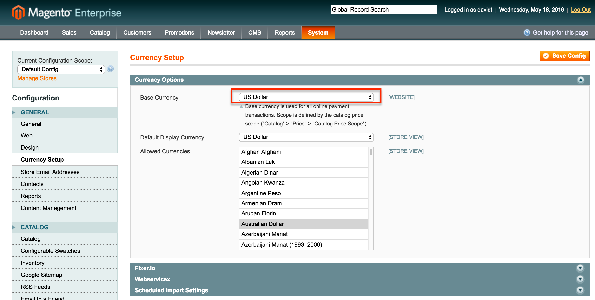
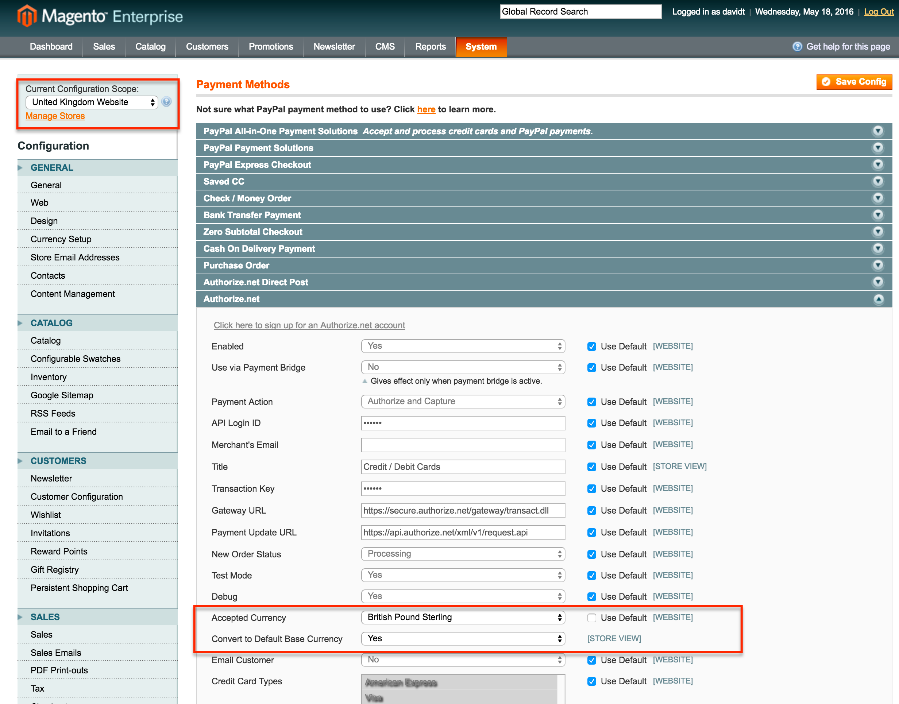

Payment Base Currency
=====================

Accept Authorize.net and Amazon Payments if your store's base currency is not USD and you don't have 
an office in the currency's native country.

Description
-----------
You have a Magento store in the USA but you want your store's base currency in another country's 
currency such as the Canadian Dollar (CAD), Pounds Sterling (GBP), Euro (EUR) or Australian 
Dollar (AUD). As you know Authorize.net will not accept a foreign currency unless your company is 
domiciled in that country; similarly with Amazon Payments. This extension will convert your store's 
base currency to USD in the background so Authorize.net and Amazon will accept the payment.

Also works with default currency other than USD. Currently supports Authorize.net and Amazon Payments, 
but can be easily customized to support other payment methods that have similar constraints.

How to use
----------

Configure your store's default currency. For example, if your company is in the USA, enter US Dollar:

Now select the website or store view where you have the native currency you want to display. Then select 
Convert to Default Currency in your target payment method. This is for Authorize.net:

On the front end, prices will be displayed in the foreign currency, but when orders are placed, the 
prices will be converted to your default currency and transmitted to Authorize.net or Amazon Payments 
in the default currency and values.